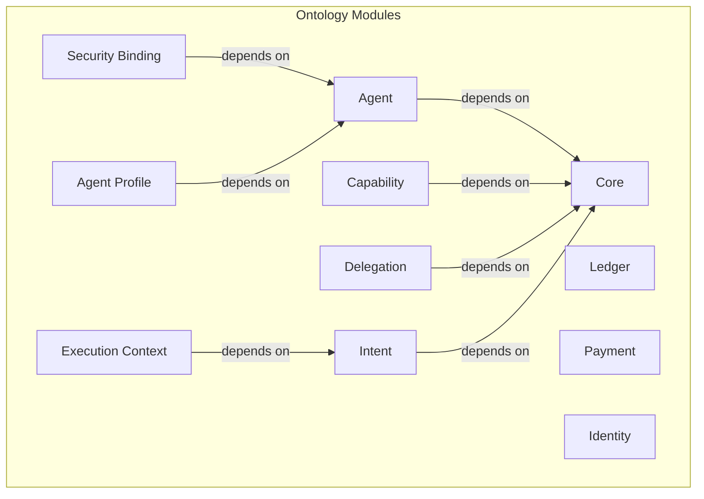

# W3C Agent Semantic Communication Community Group: AI Agent Ontology

(Note: This repository will be migrated to a dedicated GitHub organization once the Community Group is formally activated.)

This draft repository contains the formal ontology for AI Agent interoperability, security, and communication, developed as part of the **W3C Agent Semantic Communication Community Group** work. It provides a machine-readable, logically consistent framework for defining agents, their capabilities, and the rules governing their interactions.

## Vision and Goals

Our vision is to create a universal standard for safe and effective semantic communication among AI agents. This ontology serves as the foundational layer for a future where agents can securely delegate tasks, exchange value, and collaborate across different platforms and ecosystems.

**Key Goals:**
-   **Interoperability:** Define a shared vocabulary that allows agents from different developers to understand each other.
-   **Protocol-Agnostic:** Focus on the **semantic payload** of communication, ensuring the ontology can be used over any network protocol (HTTP, WebSockets, etc.) and is independent of specific agent implementations (e.g., LLMs).
-   **Security:** Anchor digital trust in physical reality by enabling agent identities and actions to be bound to hardware attestation, moving beyond purely digital security guarantees.
-   **Verifiability:** Create a complete, auditable chain of responsibility from intent to execution, providing the foundation for automated compliance, online arbitration, and system self-regulation.
-   **Extensibility:** Provide a modular core that can be extended to support diverse applications and domains.

---

## High-Level Architecture

The ontology is designed as a collection of modular, interconnected components. The `core` ontology provides the fundamental concepts, upon which other modules for agent identity, capabilities, security, and more are built.

The main entry point for the entire model is [`ontologies/ontology.ttl`](./ontologies/ontology.ttl), which imports all the necessary modules.

---

## How to Use

To use the complete ontology, we recommend loading the main entry point file in your preferred tool (e.g., Protégé for visualization, or an RDF library for programmatic access).

-   **Main Ontology File:** [`ontologies/ontology.ttl`](./ontologies/ontology.ttl)

This single file uses `owl:imports` to load the entire modular architecture, giving you access to all classes and properties.

### Validation
The repository includes a suite of [SHACL shapes](./tests/) to validate data created against the ontology. Our CI pipeline automatically runs these tests.

---

## Key Specifications

The behavior and design of this ontology are guided by several key specification documents.

-   **Minimal Threat Model ([`specs/minimal-threat-model.md`](./specs/minimal-threat-model.md)):** This is a critical document that outlines the security threats the ontology is designed to mitigate. It is essential reading for understanding the "why" behind many of the security-related components.
-   **Core Ontology Concepts ([`specs/core-ontology.md`](./specs/core-ontology.md)):** Describes the foundational classes and properties.

---

## Contributing

We welcome contributions from the community! Please read our [`CONTRIBUTING.md`](./CONTRIBUTING.md) file to learn how you can get involved, whether it's by improving the ontology, adding examples, or enhancing the documentation.
