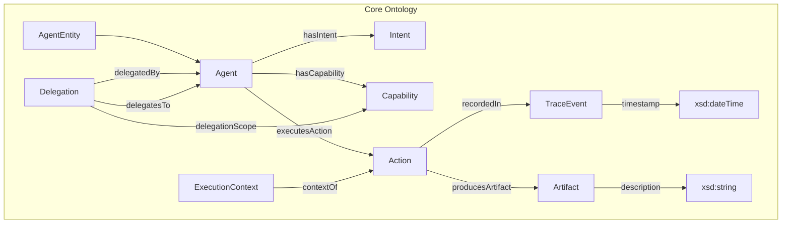

```mermaid
graph TD
    subgraph Core Ontology
        AgentEntity --> Agent
        Agent -- hasIntent --> Intent
        Agent -- hasCapability --> Capability
        Agent -- executesAction --> Action
        Delegation -- delegatedBy --> Agent
        Delegation -- delegatesTo --> Agent
        Delegation -- delegationScope --> Capability
        Action -- producesArtifact --> Artifact
        Action -- recordedIn --> TraceEvent
        ExecutionContext -- contextOf --> Action
        TraceEvent -- timestamp --> xsd:dateTime
        Artifact -- description --> xsd:string
    end
```